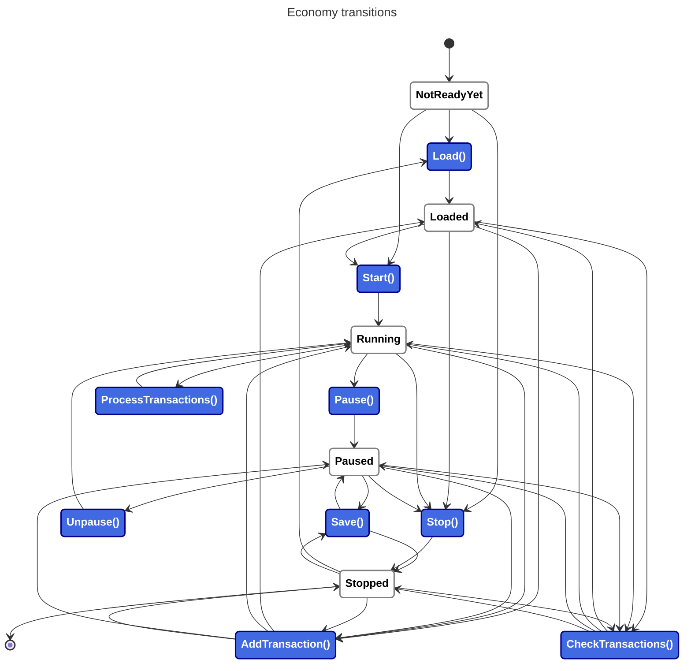
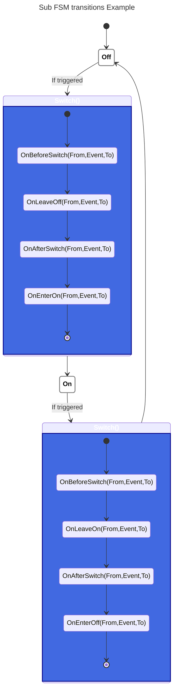

```mermaid
---
title: Economy transitions
---
stateDiagram-v2

%% Classes %%
classDef States fill:white,color:black,font-weight:bold,stroke-width:2px,stroke:grey
classDef Events fill:royalblue,color:white,font-weight:bold,stroke-width:2px,stroke:darkblue

%% States %%
NotReadyYet: NotReadyYet
Loaded: Loaded
Running: Running
Paused: Paused
Stopped: Stopped

%% Events %%
Start: Start()
Load: Load()
Pause: Pause()
Stop: Stop()
Unpause: Unpause()
Save: Save()
AddTransaction: AddTransaction()
CheckTransactions: CheckTransactions()
ProcessTransactions: ProcessTransactions()

%% Transitions %%
[*] --> NotReadyYet:::States
NotReadyYet --> Load:::Events
Load --> Loaded:::States
NotReadyYet --> Start:::Events
Start --> Running:::States
Loaded --> Start
Running --> Pause:::Events
Pause --> Paused:::States
Paused --> Unpause:::Events
Unpause --> Running
Paused --> Save:::Events
Save --> Paused
Save --> Stopped
Stopped --> Load
NotReadyYet --> Stop:::Events
Loaded --> Stop
Running --> Stop
Paused --> Stop
Stop --> Stopped:::States
Stopped --> Save
Loaded --> AddTransaction:::Events
Running --> AddTransaction
Paused --> AddTransaction
Stopped --> AddTransaction
AddTransaction --> Loaded
AddTransaction --> Running
AddTransaction --> Paused
AddTransaction --> Stopped
Loaded --> CheckTransactions:::Events
Running --> CheckTransactions
Paused --> CheckTransactions
Stopped --> CheckTransactions
CheckTransactions --> Loaded
CheckTransactions --> Running
CheckTransactions --> Paused
CheckTransactions --> Stopped
Running --> ProcessTransactions:::Events
ProcessTransactions --> Running
Stopped --> [*]

```

```mermaid
---
title: Sub FSM transitions Example
---
stateDiagram-v2
%% Classes %%
classDef States fill:white,color:black,font-weight:bold,stroke-width:2px,stroke:grey
classDef Events fill:royalblue,color:white,font-weight:bold,stroke-width:2px,stroke:darkblue

%% States %%
Off: Off
On: On

%% Events %%
Switch: Switch()
Switch2: Switch()

%% Sub FSM %%
EnterOff: OnEnterOff(From,Event,To)
LeaveOff: OnLeaveOff(From,Event,To)

EnterOn: OnEnterOn(From,Event,To)
LeaveOn: OnLeaveOn(From,Event,To)

BeforeSwitch: OnBeforeSwitch(From,Event,To)
AfterSwitch: OnAfterSwitch(From,Event,To)
BeforeSwitch2: OnBeforeSwitch(From,Event,To)
AfterSwitch2: OnAfterSwitch(From,Event,To)

[*] --> Off:::States
Off --> Switch:::Events: If triggered
state Switch {
[*] --> BeforeSwitch
BeforeSwitch --> LeaveOff
LeaveOff --> AfterSwitch
AfterSwitch --> EnterOn
EnterOn --> [*]
}
Switch --> On:::States
On --> Switch2:::Events: If triggered
state Switch2 {
[*] --> BeforeSwitch2
BeforeSwitch2 --> LeaveOn
LeaveOn --> AfterSwitch2
AfterSwitch2 --> EnterOff
EnterOff --> [*]
}
Switch2 --> Off
```